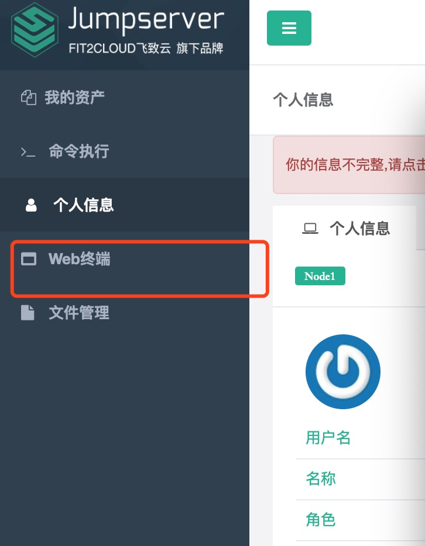
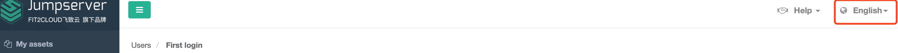

# Intro

These are the tutorials to introduce the basics of Convolutional Neural Network (CNN) development, and the principles and practices of the CNN deployment on Field Programmable Gate Arrays (FPGA).

The experiments will be ran on the remote server.  

## Connection to Server

### Web Terminal
Everyone will get a note which contains the account and password information (Ask TA for helps if you didn't get one). Use the information to log in to the website [Here](https://demo.chiefdata.net).

Then, click the web terminal.


You can also change the language you like.


## Basic of Docker
Docker is a platform for developers and sysadmins to develop, deploy, and run applications with containers.
### Images and containers
A container is launched by running an image. An image is an executable package that includes everything needed to run an application--the code, a runtime, libraries, environment variables, and configuration files.

A container is a runtime instance of an image--what the image becomes in memory when executed (that is, an image with state, or a user process). You can see a list of your running containers with the command, 'docker ps', just as you would in Linux.

### Containers and virtual machines
A container runs natively on Linux and shares the kernel of the host machine with other containers. It runs a discrete process, taking no more memory than any other executable, making it lightweight.

By contrast, a virtual machine (VM) runs a full-blown “guest” operating system with virtual access to host resources through a hypervisor. In general, VMs provide an environment with more resources than most applications need.

Docker             |  Virtual Machine
:-------------------------:|:-------------------------:
  |  

## Quick Start

Every student will be assigned a container on the server. On your web terminal, type
```
sudo docker container ls -a
```
The password for `sudo` is `admin`. 
Then, You will get information about of all the containers like this

Find the corresponding ID of your assigned container's name. For example, to resume the container `GPU_TEST`, type
```
sudo docker exec -it 82d7885c28f4 /bin/bash
```
Now, you have entered the container.


## Contact Us

If you would like to discover more please do not hesitate to contact us at:

- Professor Wayne Luk ([w.luk@imperial.ac.uk](mailto:w.luk@imperial.ac.uk))
- Shaojun Wang（shaojun.wang@corerain.com）
- Jian Tang（jian.tang@corerain.com）
