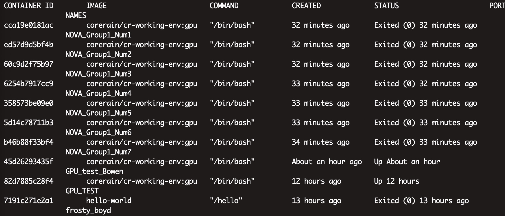

# Intro

These are the tutorials to introduce the basics of Convolutional Neural Network (CNN) development, and the principles and practices of the CNN deployment on Field Programmable Gate Arrays (FPGA).

The experiments will be ran on the remote server.  

## Connection to Server

### Web Terminal
Everyone will get a note which contains the account and password information (Ask TA for helps if you didn't get one). Use the information to log in to the website [Here](https://demo.chiefdata.net).

Then, click the web terminal.


You can also change the language you like.


### Local Terminal

#### Mac and Linux Users

If you are using MacOS or Linux, you can use **Terminal** to SSH into the server.

Open Terminal and use the following command. 

``` ssh -p 2222 username@120.236.240.57```

> Note：The server IP is fixed, username is **aiuser1** to **aiuser7**, password is **P@ssw0rd520!**

#### Windows Users

If you are a windows users, we recommend you to download the MobaXterm for our labs.


MobaXterm is an enhanced Windows terminal tool that provides all the important remote networking tools (such as SSH client tools).


You can download it from：https://mobaxterm.mobatek.net/download-home-edition.html

Download the MobaXterm Hone Edition v12.0 (Installation edition). Run the installation file (.msi) and follow the instructions in the installation GUI. 

Once the installation is complete, open MobaXterm and select Session in the menu bar, enter the session setting interface, and select SSH. Fill in the IP address of the server equipped with the Corerain acceleration card in the Remote host, you don't need to fill the username, just leave it blank.


then enter the username like **aiuser1**， and password **P@ssw0rd!** to log  in the server.


Once you log in to the server, you might see this interface , just type **1** and enter. Then you will successfully log in the server.


## Basic of Docker
Docker is a platform for developers and sysadmins to develop, deploy, and run applications with containers.
### Images and containers
A container is launched by running an image. An image is an executable package that includes everything needed to run an application--the code, a runtime, libraries, environment variables, and configuration files.

A container is a runtime instance of an image--what the image becomes in memory when executed (that is, an image with state, or a user process). You can see a list of your running containers with the command, 'docker ps', just as you would in Linux.

### Containers and virtual machines
A container runs natively on Linux and shares the kernel of the host machine with other containers. It runs a discrete process, taking no more memory than any other executable, making it lightweight.

By contrast, a virtual machine (VM) runs a full-blown “guest” operating system with virtual access to host resources through a hypervisor. In general, VMs provide an environment with more resources than most applications need.

Docker             |  Virtual Machine
:-------------------------:|:-------------------------:
  |  

## Quick Start

Every student will be assigned a container on the server. On your web terminal, type
```
sudo nvidia-docker container ls -a
```
The password for `sudo` is `admin`. 
Then, You will get information about of all the containers like this

Find the corresponding ID of your assigned container's name. For example, to resume the container `GPU_TEST`, type
```
sudo nvidia-docker exec -it 82d7885c28f4 /bin/bash
```
Now, you have entered the container. If you are in the `Num1` group, to test if you run the container successfully, type 

```
cd /NOVA/LAB/Num1/  # Change "Num1" to your own group name "Num1 ~ Num7" 
python docker_test.py
```
Then you will see the message below if you launch the container successfully:
```
"Run he docker container with TensorFlow successfully!"
```


## Contact Us

If you would like to discover more please do not hesitate to contact us at:

- Professor Wayne Luk ([w.luk@imperial.ac.uk](mailto:w.luk@imperial.ac.uk))
- Shaojun Wang（shaojun.wang@corerain.com）
- Jian Tang（jian.tang@corerain.com）
